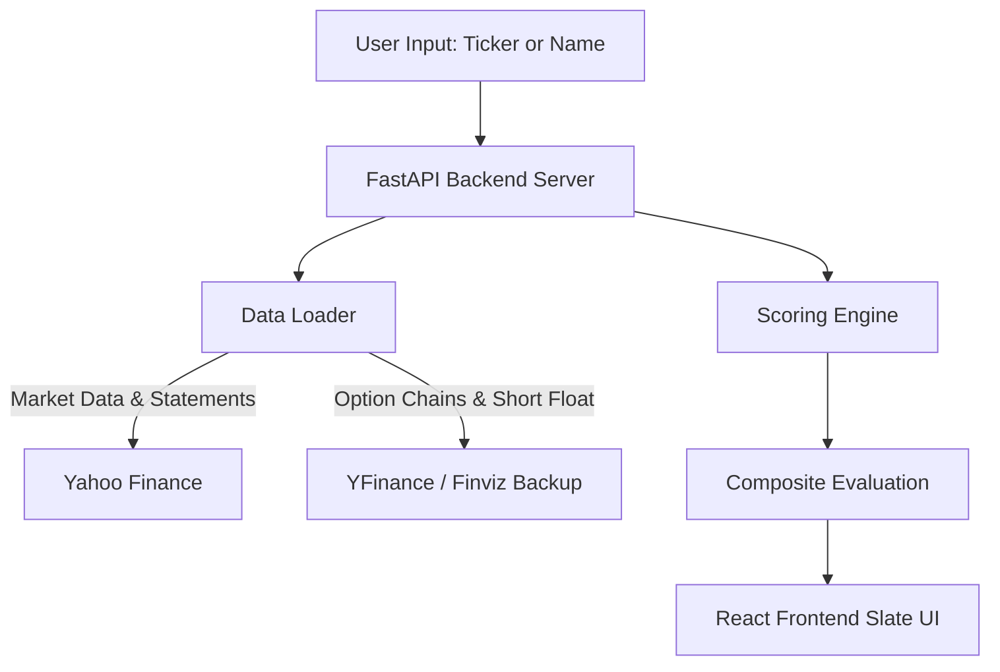
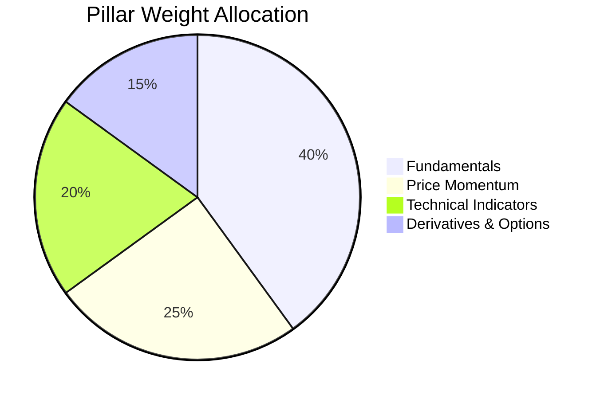
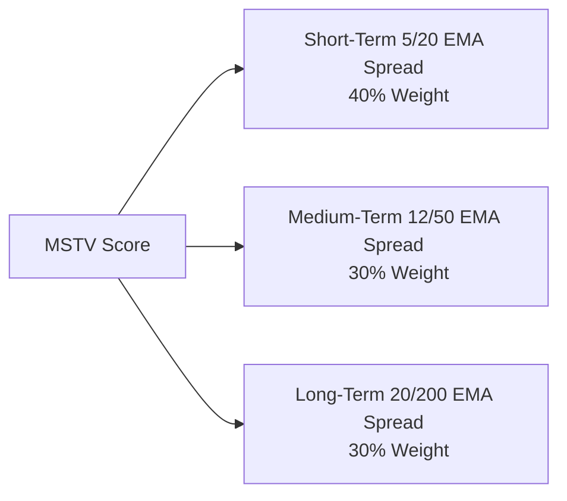

# ⚜️ Quantitative Stock Evaluator

An institutional-grade, decoupled stock evaluation dashboard built with **FastAPI** (Python) and **React** (Vite). The system filters market noise into clear, quantitative signals by evaluating assets across four core pillars: **Fundamentals**, **Multi-Scale Trend Momentum**, **Technical Indicators**, and **Derivatives/Options Metrics**.



---

## 🚀 Quick Setup

### 1. Configure Keys (Optional)
If competitor retrieval or other AI helpers are needed, configure your `.env` file in the root directory:
```env
GROQ_KEYS=your_key_1,your_key_2
```

### 2. Run Backend
```bash
cd server
pip install -r requirements.txt
python -m uvicorn main:app --reload --port 8000
```
The API will be available at **`http://localhost:8000`**. You can verify health at `/api/health`.

### 3. Run Frontend
```bash
cd client
npm install
npm run dev
```
Open **`http://localhost:5173`** to access the dashboard.

---

## 📊 Scoring Architecture

The system computes a composite score (0–100) using a multi-dimensional weighted matrix:



### 1. Fundamentals (40%)
Evaluates the core financial stability, profitability, growth rates, capital efficiency, and balance sheet safety of the target company.

| Metric / Pillar | Weight | Key Evaluation Points |
| :--- | :--- | :--- |
| **Profitability** | 35% | Return on Equity (ROE), Profit Margin, Return on Assets (ROA) |
| **Growth** | 30% | Q/Q Revenue Growth, Q/Q EPS Growth |
| **Valuation** | 15% | Sector-relative Trailing P/E, Price-to-Book (P/B) |
| **Financial Health** | 10% | Debt-to-Equity ratio |
| **FCF Quality** | 10% | Free Cash Flow Yield (FCF / Market Capitalization) |

> [!WARNING]
> **Distressed Asset Cap:** If a company's ROE or Profit Margin is negative, the entire Fundamental score is hard-capped at a maximum of **35** to protect capital from structural decline.
> 
> **Insider Purchase Booster:** Incorporates corporate insider trading. Recent corporate purchases add up to **+10 points** to the fundamental score (automatically disabled for distressed assets experiencing heavy insider selling).

---

### 2. Price Momentum (25%)
Utilizes the **Multi-Scale Trend Velocity (MSTV)** model. It computes the percentage spreads between Fast and Slow Exponential Moving Averages (EMAs) across three distinct cycles:



* **Mathematical Equations:**
  $$S_{\text{short}} = \frac{\text{EMA}_5 - \text{EMA}_{20}}{\text{EMA}_{20}} \times 100$$
  $$S_{\text{medium}} = \frac{\text{EMA}_{12} - \text{EMA}_{50}}{\text{EMA}_{50}} \times 100$$
  $$S_{\text{long}} = \frac{\text{EMA}_{20} - \text{EMA}_{200}}{\text{EMA}_{200}} \times 100$$
* **Weighted Spread:**
  $$\text{Combined Spread} = (0.40 \times S_{\text{short}}) + (0.30 \times S_{\text{medium}}) + (0.30 \times S_{\text{long}})$$
* **Normalized Score:**
  $$\text{Momentum Score} = \max\left(0, \min\left(100, 50.0 + (\text{Combined Spread} \times 4.0)\right)\right)$$

---

### 3. Technical Indicators (20%)
Measures momentum and support boundaries across 8 binary, weighted indicators:

| Technical Indicator | Weight | Condition for Success (+1 Score) |
| :--- | :--- | :--- |
| **Price Above 200 SMA** | 25% | Closing price is above the long-term 200 Simple Moving Average |
| **Price Above 50 SMA** | 20% | Closing price is above the medium-term 50 Simple Moving Average |
| **Golden Cross Active** | 15% | 50 SMA is greater than 200 SMA |
| **MACD Bullish Cross** | 15% | MACD line is above the MACD Signal line |
| **MACD Above Zero** | 10% | MACD line is positive |
| **RSI Momentum** | 8% | RSI is between 50 and 82 (uptrend) OR below 45 (oversold downtrend) |
| **Price Above 20 EMA** | 5% | Price is above short-term 20 Exponential Moving Average |
| **Bollinger Band Support** | 2% | Price is in a breakout/support zone within Bollinger bands |

---

### 4. Derivatives & Options (15%)
Analyzes institutional options open interest, implied volatility structures, and short positioning:
* **Option Flow (45% Weight):** Calculates volume-based and open-interest-based Put/Call Ratios (PCR). Low PCR signals bullish institutional hedging.
* **Implied Volatility Rank (15% Weight):** Evaluates implied volatility (IV) relative to past trends to assess pricing anomalies.
* **Short Interest (40% Weight):** Tracks short percent of float and Days to Cover.
* **Short Squeeze Watch:** Triggered when the short interest exceeds 10%, days to cover is over 8, and the underlying price remains in a technical uptrend.

---

## 🏆 Rating Classifications

| Composite Score | Signal Strength | Theme Color |
| :--- | :--- | :--- |
| **80 – 100** | **Strong Bullish** | `#f2ca50` (Gold) |
| **60 – 79** | **Bullish Bias** | `#d4af37` (Muted Gold) |
| **40 – 59** | **Neutral / Mixed** | `#a89060` (Bronze) |
| **20 – 39** | **Bearish Bias** | `#ff8070` (Muted Red) |
| **0 – 19** | **Strong Bearish** | `#ff4444` (Red) |

---

## 📈 Quantitative Backtester

The codebase includes a **historical backtesting suite** to evaluate the strategy's performance across multiple holding horizons (1-Month, 3-Month, 6-Month, and 1-Year):
* **Look-Ahead Bias Protection:** For any historical timestamp $T$, the backtester utilizes data lagged prior to $T$ (e.g., 45-day lag on financial statement releases).
* **Survival Bias Mitigation:** Aligns Point-in-Time constituent pricing.
* **Reported Risk Metrics:** Calculates Sharpe Ratio, Sortino Ratio, Maximum Drawdown, Benchmark Alpha, and Information Hit Precision (T+10, T+30, T+60 outperformance vs. SPY).
